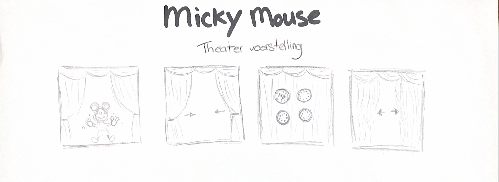
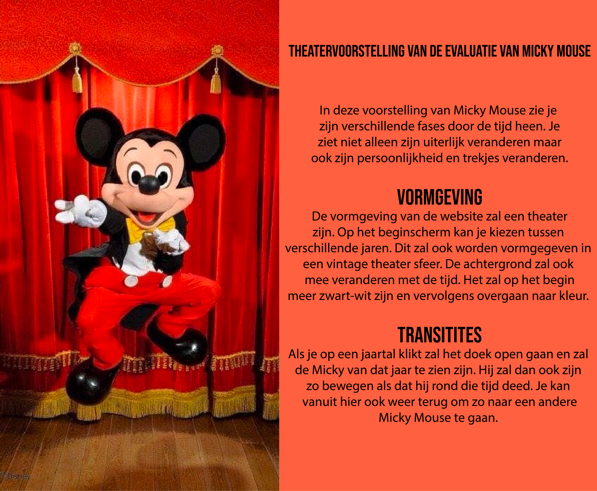
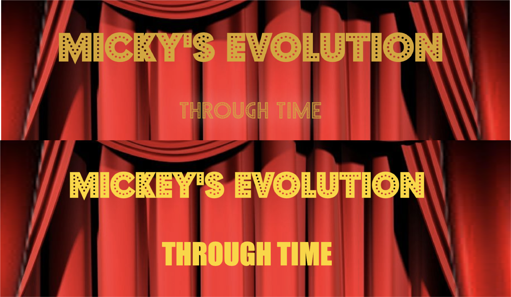

# Procesverslag
Markdown is een simpele manier om HTML te schrijven.  
Markdown cheat cheet: [Hulp bij het schrijven van Markdown](https://github.com/adam-p/markdown-here/wiki/Markdown-Cheatsheet).

Nb. De standaardstructuur en de spartaanse opmaak van de README.md zijn helemaal prima. Het gaat om de inhoud van je procesverslag. Besteedt de tijd voor pracht en praal aan je website.

Nb. Door *open* toe te voegen aan een *details* element kun je deze standaard open zetten. Fijn om dat steeds voor de relevante stuk(ken) te doen.

## Jij

### Ontwerper:
Senna Glaser

#### Je startniveau:
Mijn startniveau is: blauw

# Je plan

  
De eerste versie/schets van je ontwerp & je persoonlijke uitdaging

  ### De eerste versie/schets:
  
  
  

  ### Je ambitie: 
  Aan deze technieken/punten wil ik werken:
  - Positioneren met CSS
  - Animeren met CSS
  - Zelf HTML typen
  - Kennis op doen over javascript
 

## Voortgang/Feedback 1

  

  
  Ik ben begonnen met de achtergrond en de gordijnen. Ik wilde heel graag dat als je op de pagina komt dat de gordijnen open gaan. Dit heb ik samen met Sanne gedaan aan de hand van eem animatie. Animeren met CSS was één van mijn ambities, dus het was erg interessant om hier de eerste week meteen mee te beginnen. 

  Ik heb ook mijn eerste Micky toegevoegd en gepositioneerd. 

  Mijn bevindingen + wijzigingen (minimaal 5)
  
  

  ### Bevinding 1:
  Het idee was dat als er een nieuwe micky kwam de gordijnen dicht en weer open zouden gaan. Uit de feedback bleek dat dit vertraging brengt in de interface en je minder soepel door interface kan. 

  #### oplossing:
  Ik heb er toen voor gekozen dat de gordijnen alleen op het begin open gaan. Als je nu op een ander jaartal klikt komt meteen de goede Mickey in beeld. Je hoeft niet meer te wachtenm tot de gordijnen open zijn. 

  ### Bevinding 2:
  Ik had zelf nog niet nagedacht over geluid, dus ik kreeg als feedback dat dit een leuke extra zou kunnen zijn. Bij Mickey Mouse kan je namelijk veel passende geluiden vinden om zo de interface nog meer een geheel te maken. 

  #### oplossing:
  Geluiden zoeken die passen bij het concept en het onderwerp.

  ### Bevinding 3:
  ...

## Voortgang/Feedback 2

  

  
  
  Mijn bevindingen + wijzigingen (minimaal 5)

  
  ### Bevinding 1:
  Het contrast van de tekst was nog niet goed. Ik heb de kleur van de letter daarom wat feller geel gemaakt. Zo springen de letters er meer uit en zijn ze beter zichtbaar.

  

  #### oplossing:
  Beschrijving hoe je het hebt hebt opgelost of als het niet gelukt is hoe je het zou oplossen (tekst en afbeeding(en)).

  ### Bevinding 2:
  Omschrijving van wat er nog niet orde was (tekst en afbeeding(en)).

  #### oplossing:
  Beschrijving hoe je het hebt hebt opgelost of als het niet gelukt is hoe je het zou oplossen (tekst en afbeeding(en)).

  ### Bevinding 3:
  ...

## Voortgang/Feedback 3

  
Mijn bevindingen + wijzigingen (minimaal 5)

  
  ### Bevinding 1:
  Omschrijving van wat er nog niet orde was (tekst en afbeeding(en)).

  #### oplossing:
  Beschrijving hoe je het hebt hebt opgelost of als het niet gelukt is hoe je het zou oplossen (tekst en afbeeding(en)).

  ### Bevinding 2:
  Omschrijving van wat er nog niet orde was (tekst en afbeeding(en)).

  #### oplossing:
  Beschrijving hoe je het hebt hebt opgelost of als het niet gelukt is hoe je het zou oplossen (tekst en afbeeding(en)).

  ### Bevinding 3:
  ...

## Reflectie

  
Mijn eindresultaat & persoonlijke ontwikkeling

  ### Je uitkomst - karakteristiek screenshot(s):
  

  ### Dit ging goed/Heb ik geleerd: 
  Korte omschrijving met plaatje(s)

  

  ### Dit was lastig/Is niet gelukt:
  Korte omschrijving met plaatje(s)

  

## Bronnenlijst

continu bijhouden terwijl je werkt

Nb. Wees specifiek ('css-tricks' als bron is bijv. niet specifiek genoeg).

1. bron 1
2. bron 2
3. ...

